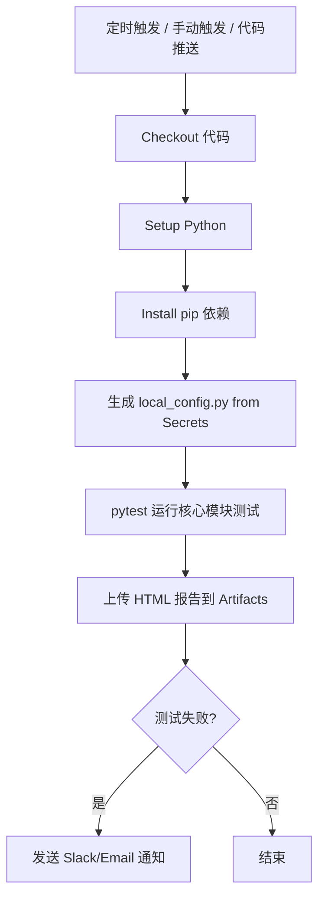

# GitHub Actions CI/CD 每日自动回归配置指南

本文介绍如何为 star_interface 项目配置 GitHub Actions，实现每日自动回归核心接口，提前拦截缺陷。

---

## 目标

- ✅ 每日定时自动运行核心接口测试
- ✅ 测试失败自动发送通知
- ✅ 保存测试报告可供下载查看
- ✅ 敏感信息（账号密码）安全存储不泄露

---

## 完整配置步骤

### 1. 创建工作流配置文件

在项目中创建文件：`.github/workflows/api-tests.yml`

```yaml
name: API Tests Daily Regression

# 触发条件
on:
  # 定时触发：每日执行
  schedule:
    # 北京时间凌晨 2:00 = UTC 前一天 18:00
    - cron: '0 18 * * *'
  # 允许手动触发（在 GitHub 网页上点击Run workflow）
  workflow_dispatch:
  # 推送到 main 分支时触发（代码变更后自动测试）
  push:
    branches: [ main ]

jobs:
  api-test:
    runs-on: ubuntu-latest  # 使用 Linux  runner，更稳定更快
    name: Run API Regression Tests
    steps:
      - name: Checkout code
        uses: actions/checkout@v4

      - name: Set up Python
        uses: actions/setup-python@v5
        with:
          python-version: '3.12'
          cache: 'pip'

      - name: Install dependencies
        run: |
          python -m pip install --upgrade pip
          pip install -r requirements.txt

      - name: Create local_config.py
        env:
          BASE_URL: ${{ secrets.BASE_URL }}
          DEFAULT_EMAIL: ${{ secrets.DEFAULT_EMAIL }}
          DEFAULT_PASSWORD: ${{ secrets.DEFAULT_PASSWORD }}
          PROJECT_ID: ${{ secrets.PROJECT_ID }}
        run: |
          cat > config/local_config.py << EOF
          BASE_URL = '$BASE_URL'
          DEFAULT_EMAIL = '$DEFAULT_EMAIL'
          DEFAULT_PASSWORD = '$DEFAULT_PASSWORD'
          PROJECT_ID = $PROJECT_ID
          EOF

      - name: Run core API tests
        run: |
          pytest -m "login or monitor or monitor_center" --html=output/report.html --self-contained-html

      - name: Upload HTML report artifact
        if: always()  # 即使测试失败也上传报告
        uses: actions/upload-artifact@v4
        with:
          name: api-test-report-${{ github.sha }}
          path: output/report.html
          retention-days: 30

      - name: Notify on failure (Slack)
        if: failure()
        uses: slackapi/slack-github-action@v1
        with:
          slack-message: |
            ❌ API 自动化回归测试失败！
            项目: ${{ github.repository }}
            分支: ${{ github.ref_name }}
            提交: ${{ github.sha }}
            查看详情: https://github.com/${{ github.repository }}/actions/runs/${{ github.run_id }}
        env:
          SLACK_WEBHOOK_URL: ${{ secrets.SLACK_WEBHOOK_URL }}
```

---

### 2. 配置 GitHub Secrets

在你的 GitHub 项目页面：

**Settings** → **Secrets and variables** → **Actions** → **New repository secret**

添加以下敏感配置（这些不会暴露在代码中）：

| Name | Value | 说明 | 是否必填 |
|------|-------|------|----------|
| `BASE_URL` | `https://star.digiplus-intl.com` | API 基础 URL | ✅ 必填 |
| `DEFAULT_EMAIL` | `your-test-email@company.com` | 测试账号邮箱 | ✅ 必填 |
| `DEFAULT_PASSWORD` | `your-test-password` | 测试账号密码 | ✅ 必填 |
| `PROJECT_ID` | `123` | 项目 ID | ✅ 必填 |
| `SLACK_WEBHOOK_URL` | `https://hooks.slack.com/services/XXX` | Slack 通知 Webhook | ⭕ 可选 |

---

### 3. 定时表达式说明

cron 表达式使用 **UTC 时间**，需要转换为北京时间：

| 想要（北京时间） | UTC 时间 | cron 表达式 |
|----------------|----------|-------------|
| 凌晨 2:00 每天 | 前一天 18:00 | `0 18 * * *` |
| 早上 8:00 每天 | 凌晨 0:00 | `0 0 * * *` |
| 中午 12:00 每天 | 早上 4:00 | `0 4 * * *` |

---

### 4. 通知方式

| 通知方式 | 配置方法 |
|----------|----------|
| **Email** | GitHub 默认发送，不需要额外配置。Workflow 失败后自动发邮件给仓库所有者 |
| **Slack** | 在 Slack 创建 App，获取 Webhook URL，存入 `SLACK_WEBHOOK_URL`，如上面配置所示 |
| **企业微信** | 使用 `cretzb/wework-action` GitHub Action，原理类似 Slack |
| **钉钉** | 使用 `zha-ji/dingding-action` GitHub Action |

---

### 5. 查看测试报告

测试完成后：

1. 打开你的 GitHub 项目 → **Actions** 标签
2. 选择左侧 `API Tests Daily Regression`
3. 点击最近一次运行
4. 下拉到 **Artifacts** 部分，下载 `api-test-report-xxxx`
5. 解压 zip 文件，打开 `report.html` 即可查看完整测试报告

报告保存 30 天，过期自动删除。

---

### 6. 工作流程图



---

### 7. 如果测试环境在内网（无法被 GitHub 公网访问）

#### 方案一：Self-hosted Runner（推荐）

GitHub 提供自托管 Runner，在了你内网的一台机器上注册 Runner，GitHub 触发后由这台机器执行测试：

1. GitHub → **Settings** → **Actions** → **Runners** → **New self-hosted runner**
2. 按照提示在你内网机器上下载安装注册
3. 配置保持不变，Runner 会自动拉取任务执行
4. 优势：内网可访问测试环境，依然用 GitHub 工作流配置

#### 方案二：Jenkins

在内网自己搭 Jenkins：

1. 新建流水线
2. 配置定时触发器（`H 2 * * *` 每日凌晨 2 点）
3. 流水线脚本：
   ```groovy
   pipeline {
       agent any
       triggers {
           cron('H 2 * * *')
       }
       stages {
           stage('Checkout') {
               steps {
                   git 'https://github.com/your-username/star-interface.git'
               }
           }
           stage('Install Dependencies') {
               steps {
                   sh 'pip install -r requirements.txt'
               }
           }
           stage('Run Tests') {
               steps {
                   sh 'pytest -m "login or monitor or monitor_center" --html=output/report.html'
               }
           }
       }
       post {
           always {
               publishHTML(target: [
                   allowMissing: false,
                   alwaysLinkToLastBuild: true,
                   keepAll: true,
                   reportDir: 'output',
                   reportFiles: 'report.html',
                   reportName: 'API Test Report'
               ])
           }
           failure {
               // 发送邮件通知
               emailext(
                   to: 'team@company.com',
                   subject: 'API 回归测试失败 - \${BUILD_NUMBER}',
                   body: '请查看测试报告'
               )
           }
       }
   }
   ```

#### 方案三：其他 CI 平台

GitLab CI、阿里云效、腾讯云DevOps、CircleCI 流程类似：

1. 配置定时触发
2. 配置环境变量（敏感信息加密存储）
3. 拉代码 → 装依赖 → 运行 pytest
4. 上传报告 → 失败通知

---

### 8. 优缺点对比

| 方案 | 优点 | 缺点 |
|------|------|------|
| GitHub Actions（公网） | GitHub 免费，配置简单，和代码一体 | 需要测试环境可公网访问 |
| GitHub Actions Self-hosted | 内网可访问，仍用 GitHub 工作流 | 需要自己维护一台机器运行 runner |
| Jenkins 自建 | 完全可控，内网可访问 | 需要自己维护 Jenkins 实例 |
| 云效/DevOps | 云厂商提供，不用自己维护 | 需要公有云账号 |

---

### 9. 本项目 CI 最佳实践建议

1. **每日回归核心模块**：只运行 `login or monitor or monitor_center`，避免运行全部测试用例浪费时间
2. **代码推送触发**：每次合并到 main 自动测试，保证代码合并后不破坏现有功能
3. **失败必通知**：通过 Slack/邮件通知负责人，提前拦截缺陷到上线前
4. **报告保留 30 天**：方便回溯历史问题
5. **敏感信息一律存在 Secrets**：绝不把账号密码提交到代码仓库

---

### 10. 常见问题

**Q: GitHub Actions 免费配额够用吗？**

A: GitHub 免费账户每月有 2000 分钟免费额度，每日一次运行只需要几分钟，完全够用。

**Q: 测试报告中文会乱码吗？**

A: 本项目在执行完 pytest 后生成的 report.html 本身需要转换为 UTF-8 with BOM 在 Windows 上才正常。如果在 Linux runner 上运行，生成的报告本身就是 UTF-8，下载后浏览器打开不会乱码。

**Q: 可以同时生成 Allure 报告吗？**

A: 可以，安装 allure 命令行后，使用 `allure generate output/allure-results -o output/allure-report`，然后整个 `output/allure-report` 目录上传为 artifact 即可。
