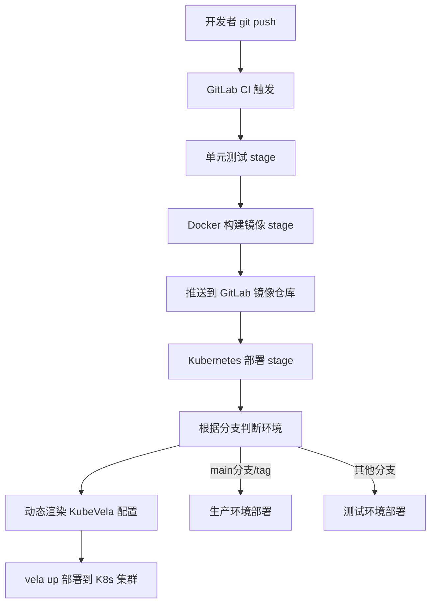

# GitLab CI + Docker + Kubernetes + KubeVela 多环境部署流水线

## 流水线概述

这是一个**企业级生产级 GitLab CI/CD 流水线**，用于 Java SpringBoot 应用部署到 Kubernetes 容器平台，支持**测试环境/生产环境自动区分部署**，使用 KubeVela 进行应用管理。

## 整体架构流程图



---

## 核心设计思想

### 1. 多环境配置分离

- **代码分支** ↔ **环境映射**：
  - `main` 分支 / Git Tag → 生产环境
  - `test` 分支 / 其他分支 → 测试环境
- **资源配额区分**：生产环境 2 副本更多资源，测试环境 1 副本节省资源
- **配置映射区分**：不同环境使用不同 ConfigMap 和 PVC

### 2. 动态渲染配置

通过 shell 从 GitLab CI 环境变量 → 动态渲染 `vela-template.yaml → 生成最终 `vela.yaml`：

- 自动处理 ConfigMap 挂载
- 自动处理 PVC 日志存储挂载
- 不需要在模板中硬编码环境相关配置

### 3. 使用 KubeVela (OAM) 管理应用

相比手写 Deployment/Service/Ingress 一大堆 YAML，KubeVela 提供更高层次的抽象：
- 声明式应用模型，更少配置
- 自动化处理滚动更新
- `vela up -f vela.yaml` 一键部署

---

## 完整配置分析

### 触发条件

```yaml
workflow:
  rules:
    - if: $CI_COMMIT_TAG              # 打Tag时触发
    - if: '$CI_PIPELINE_SOURCE == "web"' # GitLab网页手动触发
    - if: '$CI_COMMIT_REF_NAME == "test" || $CI_COMMIT_REF_NAME == "main"'
```

支持三种触发方式，覆盖：
- 正式发布打Tag
- 开发者手动触发
- 分支提交自动触发

---

## 环境变量配置

| 分类 | 说明 |
|------|------|
| 通用配置 | 集群名、镜像名、端口、健康检查路径 |
| 生产环境 | Namespace、应用名、副本数、CPU/内存配额、ConfigMap、PVC |
| 测试环境 | 对应生产环境的测试配置，资源更小 |

---

## 阶段详解

### Stage 1: docker_build_job

```yaml
script:
  - mvn clean package -Dmaven.test.skip=true
  - docker build -t $CI_REGISTRY/${CI_PROJECT_NAMESPACE}/${IMAGE_NAME}:$CI_COMMIT_SHA .
  - docker login -u $CI_REGISTRY_USER -p $CI_JOB_TOKEN $CI_REGISTRY
  - docker push $CI_REGISTRY/${CI_PROJECT_NAMESPACE}/${IMAGE_NAME}:$CI_COMMIT_SHA
```

**作用**：
1. maven 打包 SpringBoot 应用成 jar 包
2. 构建 Docker 镜像，TAG 用 `$CI_COMMIT_SHA`（提交哈希，精确版本）
3. 推送到 GitLab 内置镜像仓库

---

### Stage 2: deploy

**第一步：根据分支判断环境变量**

```bash
if [[ "${CI_COMMIT_REF_NAME}" == "main" || -n "${CI_COMMIT_TAG}" ]]; then
  export APP_NAME="${PROD_APP_NAME}"
  ... 生产环境变量...
else
  export APP_NAME="${TEST_APP_NAME}"
  ... 测试环境变量...
fi
```

通过 bash 判断分支，自动导出对应环境的变量。

**第二步：动态生成 ConfigMap/PVC 挂载**

```bash
PROPS=""
if [ -n "${CM_NAME}" ] && [ -n "${CM_PATH}" ]; then
  PROPS="${PROPS}$(printf '\n    configMap:\n      - name: %s\n        mountPath: %s' "${CM_NAME}" "${CM_PATH}")"
fi
...
RAW_BLOCK=$(printf -- "- type: storage\n  properties:%s" "${PROPS}")
```

通过 printf + sed 生成符合 KubeVela storage trait 的 YAML 片段，最终注入到模板中。

**第三步：渲染模板并部署**

```bash
envsubst < vela-template.yaml > vela.yaml
vela up -f vela.yaml -n ${NAMESPACE} -w --timeout 5m
```

- `envsubst` → 将模板中的 `${VAR}` 替换为环境变量
- `vela up` → KubeVela 声明式部署，等待部署完成超时 5 分钟

---

## 优点总结

✅ **设计清晰**：多环境变量分开定义，一目了然  
✅ **节省资源**：测试环境只开 1 副本，资源配额更小  
✅ **动态灵活**：ConfigMap/PVC 动态渲染，模板不硬编码  
✅ **多种触发**：自动+手动+Tag，覆盖开发测试发布全流程  
✅ **KubeVela 简化**：比原生 K8s 更少配置，更易维护  

---

## ⚠️ 问题与改进建议

### 1. 未定义存储变量问题

**问题**：代码中导出了 `STORAGE_REQUEST` / `STORAGE_LIMIT`，但 variables 段没有定义：

```bash
export STORAGE_REQUEST="${PROD_STORAGE_REQUEST}"  # PROD_STORAGE_REQUEST 未定义
```

**解决**：在 variables 添加：

```yaml
# 生产环境增加
PROD_STORAGE_REQUEST: "10Gi"
PROD_STORAGE_LIMIT: "20Gi"

# 测试环境增加
TEST_STORAGE_REQUEST: "5Gi"
TEST_STORAGE_LIMIT: "10Gi"
```

### 2. Cache 配置不合理

**问题**：

```yaml
cache:
  key: $CI_PROJECT_DIR
```

缓存整个项目目录，没缓存 maven 依赖，每次构建都重新下载依赖，构建慢。

**解决**：缓存 `~/.m2/repository 按 pom.xml 缓存：

```yaml
cache:
  - key:
      files:
        - pom.xml
    paths:
      - ~/.m2/repository
```

### 3. 缺少单元测试阶段

**问题**：直接 `-Dmaven.test.skip=true 跳过单元测试，缺陷不能提前发现。

**解决**：增加独立 test stage：

```yaml
stages:
  - test
  - docker_build
  - deploy_k8s

unit_test:
  tags:
    - C3-Runner-Shell
  stage: test
  script:
    - mvn clean test
```

### 4. 镜像 TAG 建议增加分支标签

建议同时打 `${CI_COMMIT_REF_NAME}` 标签，方便回滚到对应分支最新版本：

```bash
docker build -t $CI_REGISTRY/${CI_PROJECT_NAMESPACE}/${IMAGE_NAME}:$CI_COMMIT_SHA .
# 添加这两行：
docker tag $CI_REGISTRY/${CI_PROJECT_NAMESPACE}/${IMAGE_NAME}:$CI_COMMIT_SHA \
     $CI_REGISTRY/${CI_PROJECT_NAMESPACE}/${IMAGE_NAME}:$CI_COMMIT_REF_NAME
docker push $CI_REGISTRY/${CI_PROJECT_NAMESPACE}/${IMAGE_NAME}:$CI_COMMIT_SHA
docker push $CI_REGISTRY/${CI_PROJECT_NAMESPACE}/${IMAGE_NAME}:$CI_COMMIT_REF_NAME
```

---

## 完整改进后的配置

```yaml
stages:
  - test
  - docker_build
  - deploy_k8s

workflow:
  rules:
    - if: $CI_COMMIT_TAG
    - if: '$CI_PIPELINE_SOURCE == "web" || $CI_JOB_MANUAL == "true"'
    - if: '$CI_COMMIT_REF_NAME == "test" || $CI_COMMIT_REF_NAME == "main" || $CI_JOB_MANUAL == "true"'

variables:
  # ==============================================================================
  # === 部署目标与通用配置 (Developer 可配置) ===
  # ==============================================================================
  TARGET_CLUSTER_NAME: 'vke-gz-1'
  IMAGE_NAME: star-api
  PORT: 8080
  PROBE_PATH: '/star-api/actuator/health/liveness'
  PROBE_INITIAL_DELAY: 30

  # ==============================================================================
  # === 生产环境资源配置 ===
  # ==============================================================================
  PROD_NAMESPACE: doc
  PROD_APP_NAME: star-api
  PROD_REPLICAS: "2"
  PROD_CPU: "150m"
  PROD_MEMORY: "512Mi"
  PROD_CPU_LIMIT: "2"
  PROD_MEMORY_LIMIT: "4Gi"
  PROD_STORAGE_REQUEST: "10Gi"
  PROD_STORAGE_LIMIT: "20Gi"

  PROD_CONFIGMAP_NAME: 'star-api-main'
  PROD_CONFIGMAP_PATH: '/config/'
  PROD_PVC_NAME: 'star-api-pvc'
  PROD_PVC_PATH: '/logs'

  # ==============================================================================
  # === 测试环境资源配置 ===
  # ==============================================================================
  TEST_NAMESPACE: doc
  TEST_APP_NAME: star-api-test
  TEST_REPLICAS: "1"                 # 测试只 1 个
  TEST_CPU: "100m"
  TEST_MEMORY: "256Mi"
  TEST_CPU_LIMIT: "1"
  TEST_MEMORY_LIMIT: "2Gi"
  TEST_STORAGE_REQUEST: "5Gi"
  TEST_STORAGE_LIMIT: "10Gi"

  TEST_CONFIGMAP_NAME: 'star-api-test'
  TEST_CONFIGMAP_PATH: '/config/'
  TEST_PVC_NAME: 'star-api-test-pvc'
  TEST_PVC_PATH: '/logs'

# 缓存 maven 依赖，加速构建
cache:
  - key:
      files:
        - pom.xml
    paths:
      - ~/.m2/repository

# 单元测试阶段
unit_test:
  tags:
    - C3-Runner-Shell
  stage: test
  script:
    - mvn clean test

docker_build_job:
  tags:
    - C3-Runner-Shell
  stage: docker_build
  script:
    - mvn clean package -Dmaven.test.skip=true
    - docker build -t $CI_REGISTRY/${CI_PROJECT_NAMESPACE}/${IMAGE_NAME}:$CI_COMMIT_SHA .
    - docker tag $CI_REGISTRY/${CI_PROJECT_NAMESPACE}/${IMAGE_NAME}:$CI_COMMIT_SHA $CI_REGISTRY/${CI_PROJECT_NAMESPACE}/${IMAGE_NAME}:$CI_COMMIT_REF_NAME
    - docker login -u $CI_REGISTRY_USER -p $CI_JOB_TOKEN $CI_REGISTRY
    - docker push $CI_REGISTRY/${CI_PROJECT_NAMESPACE}/${IMAGE_NAME}:$CI_COMMIT_SHA
    - docker push $CI_REGISTRY/${CI_PROJECT_NAMESPACE}/${IMAGE_NAME}:$CI_COMMIT_REF_NAME

deploy:
  tags:
    - C3-Runner-Shell
  stage: deploy_k8s
  script:
    # -------------------------------------------------------
    # 1. 变量计算部分
    # -------------------------------------------------------
    - |
      if [[ "${CI_COMMIT_REF_NAME}" == "main" || -n "${CI_COMMIT_TAG}" ]]; then
        export APP_NAME="${PROD_APP_NAME}"
        export DEPLOY_ENV="prod"
        export REPLICAS="${PROD_REPLICAS}"
        export CPU_REQUEST="${PROD_CPU}"
        export MEMORY_REQUEST="${PROD_MEMORY}"
        export CPU_LIMIT="${PROD_CPU_LIMIT}"
        export MEMORY_LIMIT="${PROD_MEMORY_LIMIT}"
        export NAMESPACE="${PROD_NAMESPACE}"
        export STORAGE_REQUEST="${PROD_STORAGE_REQUEST}"
        export STORAGE_LIMIT="${PROD_STORAGE_LIMIT}"

        # 挂载变量赋值
        export CM_NAME="${PROD_CONFIGMAP_NAME}"
        export CM_PATH="${PROD_CONFIGMAP_PATH}"
        export PVC_NAME="${PROD_PVC_NAME}"
        export PVC_PATH="${PROD_PVC_PATH}"

      else
        # 测试环境变量映射
        export APP_NAME="${TEST_APP_NAME}"
        export DEPLOY_ENV="test"
        export REPLICAS="${TEST_REPLICAS}"
        export CPU_REQUEST="${TEST_CPU}"
        export MEMORY_REQUEST="${TEST_MEMORY}"
        export CPU_LIMIT="${TEST_CPU_LIMIT}"
        export MEMORY_LIMIT="${TEST_MEMORY_LIMIT}"
        export NAMESPACE="${TEST_NAMESPACE}"
        export STORAGE_REQUEST="${TEST_STORAGE_REQUEST}"
        export STORAGE_LIMIT="${TEST_STORAGE_LIMIT}"
        export CM_NAME="${TEST_CONFIGMAP_NAME}"
        export CM_PATH="${TEST_CONFIGMAP_PATH}"
        export PVC_NAME="${TEST_PVC_NAME}"
        export PVC_PATH="${TEST_PVC_PATH}"
      fi

      export IMAGE_PULL_SECRET="${IMAGE_PULL_SECRET}"
      export IMAGE="${CI_REGISTRY}/${CI_PROJECT_NAMESPACE}/${IMAGE_NAME}:${CI_COMMIT_SHA}"

    # -------------------------------------------------------
    # 2. ConfigMap/PVC 动态渲染
    # -------------------------------------------------------
    - |
      PROPS=""
      if [ -n "${CM_NAME}" ] && [ -n "${CM_PATH}" ]; then
        PROPS="${PROPS}$(printf '\n    configMap:\n      - name: %s\n        mountPath: %s' "${CM_NAME}" "${CM_PATH}")"
      fi
      if [ -n "${PVC_NAME}" ] && [ -n "${PVC_PATH}" ]; then
        PROPS="${PROPS}$(printf '\n    pvc:\n      - name: %s\n        mountPath: %s' "${PVC_NAME}" "${PVC_PATH}")"
      fi

      export STORAGE_TRAIT_BLOCK=""
      if [ -n "${PROPS}" ]; then
        RAW_BLOCK=$(printf -- "- type: storage\n  properties:%s" "${PROPS}")
        STORAGE_TRAIT_BLOCK=$(echo "$RAW_BLOCK" | sed '1!s/^/        /')
        export STORAGE_TRAIT_BLOCK
      fi

    # -------------------------------------------------------
    # 3. 渲染配置并部署
    # -------------------------------------------------------
    - echo "🚀 生成 Application 配置..."
    - envsubst < vela-template.yaml > vela.yaml
    - echo "📄 最终配置预览:"
    - cat vela.yaml
    - echo "🚀 开始部署..."
    - vela up -f vela.yaml -n ${NAMESPACE} -w --timeout 5m
```

---

## 如何接入接口自动化测试

如果需要在部署后自动运行接口自动化测试（就是当前 star_interface 项目），可以在流水线末尾增加：

```yaml
# 在 stages 增加
stages:
  - test          # 后端单元测试
  - docker_build  # 构建Docker镜像
  - deploy_k8s    # 部署到K8s
  - api_test      # 接口自动化测试（新增）

api_test:
  tags:
    - C3-Runner-Shell
  stage: api_test
  only:
    - main
    - test
    - web
  script:
    - pip install -r requirements.txt
    # 只运行核心模块测试
    - pytest -m "login or monitor or monitor_center" --html=output/report.html
  when: manual  # 手动触发，或 always 自动执行
  artifacts:
    paths:
      - output/report.html
    expire_in: 30 days
```

这样部署完成后自动运行接口自动化，测试报告作为 artifact 保存，可以下载查看。

---

## KubeVela 模板 vela-template.yaml 示例

```yaml
apiVersion: core.oam.dev/v1beta1
kind: Application
metadata:
  name: ${APP_NAME}
  namespace: ${NAMESPACE}
spec:
  components:
    - name: ${APP_NAME}
      type: webservice
      properties:
        image: ${IMAGE}
        imagePullSecrets:
          - name: ${IMAGE_PULL_SECRET}
        port: ${PORT}
        livenessProbe:
          httpGet:
            path: ${PROBE_PATH}
            port: ${PORT}
          initialDelaySeconds: ${PROBE_INITIAL_DELAY}
        cpu:
          requests: ${CPU_REQUEST}
          limits: ${CPU_LIMIT}
        memory:
          requests: ${MEMORY_REQUEST}
          limits: ${MEMORY_LIMIT}
        replicas: ${REPLICAS}
      traits:
${STORAGE_TRAIT_BLOCK}
```

可以看到 `STORAGE_TRAIT_BLOCK` 就是之前动态生成的，这样就能根据环境不同挂载不同的配置。
