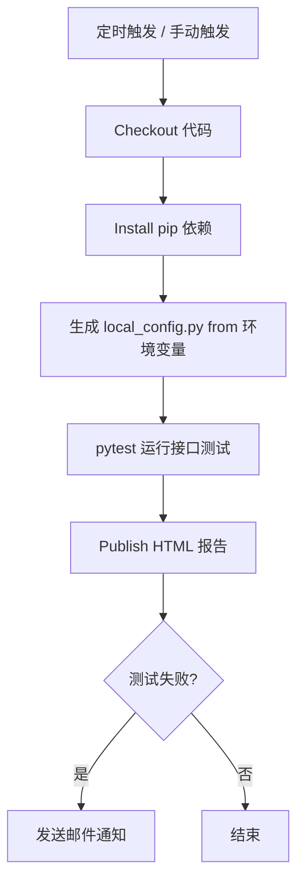

# Jenkins 实现 star_interface 接口自动化每日回归完整指南

本文介绍如何在 Jenkins 上配置 **star_interface** 接口自动化项目，实现每日定时回归、发送邮件通知、保存历史测试报告。

---

## 一、前置准备（Jenkins 环境需要安装）

### 1. Jenkins 必备插件

在 Jenkins → Manage Jenkins → Plugins → 安装这些插件：

| 插件名称 | 用途 |
|---------|------|
| **Git plugin** | 拉取 GitHub/GitLab 代码 |
| **Python plugin** | Python 环境支持 |
| **Email Extension Plugin** | 增强邮件通知（HTML报告） |
| **HTML Publisher plugin** | 展示 HTML 测试报告 |
| **Credentials Binding Plugin** | 安全管理凭证（账号密码） |
| **Timestamper** | 日志添加时间戳 |
| **Workspace Cleanup** | （可选）清理工作空间 |

### 2. 构建机器依赖（Jenkins Agent 节点需要安装）

```bash
# 1. 安装 Python 3.8+
python --version

# 2. 安装 pip 依赖
pip install -r requirements.txt

# （可选）如果需要 Allure 报告，安装 allure 命令行
# 下载地址: https://github.com/allure-framework/allure2/releases
```

---

## 二、两种配置方式对比

| 方式 | 优点 | 缺点 | 推荐 |
|------|------|------|------|
| **Freestyle 项目（界面配置）** | 配置简单，初学者友好 | 配置散落在界面，不好版本管理 | ✅ 推荐新手 |
| **Pipeline (Jenkinsfile)** | 配置即代码，跟随项目版本管理 | 需要写 Jenkinsfile | ✅ 推荐进阶使用 |

---

## 三、方式一：Freestyle 项目配置步骤

### 1. 新建任务

- 点击 **New Item**
- 输入项目名：`star-api-interface-test`
- 选择 **Freestyle project** → 点击 OK

### 2. 配置源码管理

- **Source Code Management** → 选择 **Git**
- **Repository URL**: `https://github.com/你的用户名/star-interface.git`
- **Credentials**: 添加 GitHub 凭证（如果是私有仓库）
- **Branches to build**: `*/main`

### 3. 配置定时触发（每日执行）

- **Build Triggers** → 勾选 **Build periodically**
- **Schedule** 输入（北京时间每日凌晨 2:30）：
```
# 格式：分 时 日 月 周
30 18 * * *
```
> 说明：Jenkins 定时使用 UTC 时间，北京时间凌晨 2:30 = UTC 前一天 18:30

### 4. 配置环境变量（敏感信息安全存储）

在 Jenkins → Manage Jenkins → Credentials → System → Global credentials → 添加凭证：

| 变量名 | 类型 | 说明 |
|--------|------|------|
| `star_base_url` | Secret text | API 基础 URL |
| `star_default_email` | Secret text | 测试账号邮箱 |
| `star_default_password` | Secret text | 测试账号密码 |
| `star_project_id` | Secret text | 项目 ID |

然后在 Freestyle → **Build Environment** → 勾选 **Use secret text(s) or file(s)**，添加这些变量。

### 5. 构建步骤（Execute shell）

添加 **Execute shell** 构建步骤，输入：

```bash
# 1. 创建 local_config.py 从环境变量
cat > config/local_config.py << EOF
BASE_URL = '$BASE_URL'
DEFAULT_EMAIL = '$DEFAULT_EMAIL'
DEFAULT_PASSWORD = '$DEFAULT_PASSWORD'
PROJECT_ID = $PROJECT_ID
EOF

# 2. 安装依赖（如果依赖有变化）
pip install --upgrade pip
pip install -r requirements.txt

# 3. 运行核心模块接口测试，生成HTML报告
pytest -m "login or monitor or monitor_center" --html=output/report.html --self-contained-html

# 4. （可选）转换 UTF-8 with BOM 解决 Windows 中文乱码
# 如果 Jenkins Agent 在 Linux 可以跳过这一步
# python -c "
# with open('output/report.html', 'r', encoding='gbk') as f:
#     c = f.read()
# with open('output/report.html', 'w', encoding='utf-8-sig') as f:
#     f.write(c)
# "
```

### 6. 配置报告展示

- **Post-build Actions** → 点击 **Add post-build action** → 选择 **Publish HTML reports**
- **HTML directory to archive**: `output`
- **Index page[s]**: `report.html`
- **Report name**: `API Test Report`
- 勾选 **Keep past HTML reports**

### 7. 配置邮件通知

- **Post-build Actions** → **Add post-build action** → 选择 **Editable Email Notification**

- **Project Recipient List**: 输入收件人邮箱，空格分隔
- **Triggers** → 勾选 **Failure - Any** 和 **Fixed**
- **Default Content** 示例：

```
项目: $PROJECT_NAME
构建编号: $BUILD_NUMBER
构建状态: $BUILD_STATUS
查看报告: $BUILD_URLartifact/API%20Test%20Report/report.html
提交信息: $CHANGES
```

---

## 四、方式二：Pipeline (Jenkinsfile) 方式

### 1. 在项目根目录创建 `Jenkinsfile`

```groovy
pipeline {
    agent any

    triggers {
        // 定时触发：北京时间每日凌晨 2:30
        cron('30 18 * * *')
    }

    environment {
        // 敏感信息从 Jenkins Credentials 获取
        BASE_URL = credentials('star_base_url')
        DEFAULT_EMAIL = credentials('star_default_email')
        DEFAULT_PASSWORD = credentials('star_default_password')
        PROJECT_ID = credentials('star_project_id')
    }

    stages {
        stage('Checkout') {
            steps {
                checkout scm
            }
        }

        stage('Install Dependencies') {
            steps {
                sh '''
                    pip install --upgrade pip
                    pip install -r requirements.txt
                '''
            }
        }

        stage('Generate local_config') {
            steps {
                sh '''
                    cat > config/local_config.py << EOF
BASE_URL = '$BASE_URL'
DEFAULT_EMAIL = '$DEFAULT_EMAIL'
DEFAULT_PASSWORD = '$DEFAULT_PASSWORD'
PROJECT_ID = $PROJECT_ID
EOF
                '''
            }
        }

        stage('Run API Tests') {
            steps {
                sh '''
                    pytest -m "login or monitor or monitor_center" --html=output/report.html --self-contained-html
                '''
            }
            always {
                // 即使失败也保存报告
                publishHTML(target: [
                    allowMissing: false,
                    alwaysLinkToLastBuild: true,
                    keepAll: true,
                    reportDir: 'output',
                    reportFiles: 'report.html',
                    reportName: 'API Test Report'
                ])
            }
        }
    }

    post {
        failure {
            // 失败发送邮件
            mail to: 'team@company.com',
                  subject: "API Regression Test Failed: ${env.JOB_NAME} #${env.BUILD_NUMBER}",
                  body: "查看构建详情: ${env.BUILD_URL}\n查看报告: ${env.BUILD_URL}artifact/output/report.html"
        }
        always {
            // （可选）清理工作空间，节省磁盘
            cleanWs()
        }
    }
}
```

### 2. Jenkins 配置

- 新建任务 → 选择 **Pipeline**
- **Pipeline** → 选择 **Pipeline script from SCM**
- 选择 **Git** → 输入仓库地址
- **Script Path**: `Jenkinsfile` → 保存

---

## 五、完整流程图



---

## 六、最佳实践

### 1. 敏感信息管理

- **永远不要**把 `local_config.py` 带账号密码提交到 Git
- 使用 Jenkins Credentials 存储，通过环境变量注入，安全可靠

### 2. 报告保存

- 勾选 "Keep past HTML reports" 可以保留历史报告
- 方便回溯对比不同版本测试结果

### 3. 触发方式组合

```
- 定时触发：每日凌晨回归
- 手动触发：开发者可以随时手动跑
- 可以配置推送触发：代码推送后自动测试
```

### 4. 资源清理

可以在构建完成后清理工作空间，避免磁盘占满：
- 在 Post-build Actions 添加 "Delete workspace when build is done"
- 或者在 Pipeline 中使用 `cleanWs()`

### 5. 仅运行变更模块

如果只想测试新增/修改的模块，可以动态提取模块名运行：

```bash
# 获取变更文件，提取模块名，动态构造 pytest -m 参数
pytest -m ${changed_module}
```

---

## 七、与 GitHub Actions / GitLab CI 对比

| 对比项 | Jenkins | GitHub Actions | GitLab CI |
|--------|---------|----------------|-----------|
| 部署 | 需要自己维护 Jenkins | GitHub 托管免费 | GitLab 托管免费 |
| 内网支持 | 可以部署在内网，支持内网测试环境 | 需要 Self-hosted Runner | 可以部署在内网 |
| 配置方式 | Freestyle/Pipeline 两种 | YAML | YAML |
| 插件生态 | 非常丰富 | 通过市场 Action | 丰富 |

**选型建议**：
- 如果公司已经有 Jenkins 基础设施 → 用 Jenkins
- 如果代码放在 GitHub → 用 GitHub Actions 更方便
- 如果代码放在 GitLab → 用 GitLab CI 更方便

---

## 八、常见问题

### Q: 报告中文乱码怎么办？

A:
- 如果 Jenkins Agent 在 Linux，pytest 生成的报告本身就是 UTF-8，浏览器打开正常
- 如果 Jenkins Agent 在 Windows，需要添加一步转换：
  ```python
  python -c "
  with open('output/report.html', 'r', encoding='gbk') as f:
      content = f.read()
  with open('output/report.html', 'w', encoding='utf-8-sig') as f:
      f.write(content)
  "
  ```

### Q: 登录失败怎么办？

A: 检查：
1. `local_config.py` 是否正确生成
2. 环境变量是否正确注入 Jenkins
3. 测试账号是否有效，密码是否正确
4. API 地址是否可访问，Jenkins 机器网络是否连通

### Q: 如何只在失败时发邮件？

A: 在 Post-build Actions 只配置 **Failure** 和 **Fixed** 触发器，成功不发邮件，减少邮件骚扰。
